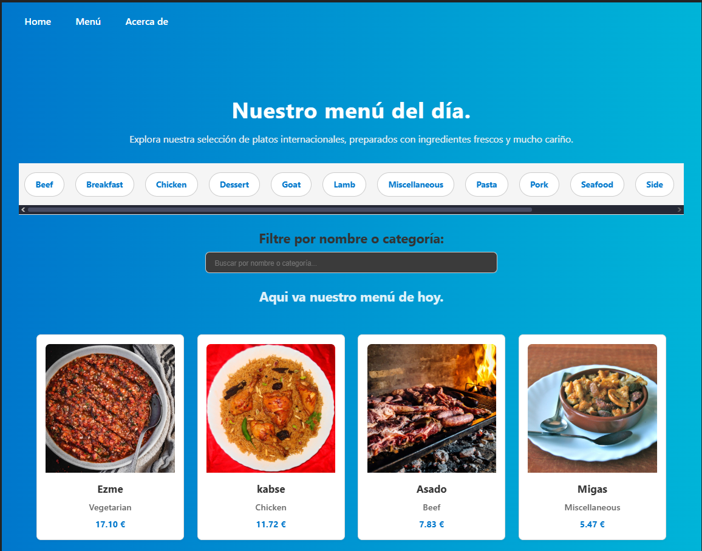

# Restaurante App 🍽️

Aplicación web desarrollada en **React** que muestra una carta de platos obtenidos desde la API pública de [TheMealDB].

Cada plato se presenta con imagen, nombre, categoría y precio.

Ampliado: Se permite al usuario filtrar por nombre o categoría.

En la última actualización se añade un nuevo menú interactivo. Los datos ahora se gestionan con **React Router DOM** para la
implementación con **enrutamiento dinámico y subrutas**.

---

## 📸 Captura de pantalla



La imagen muestra la **vista de menú completo** (`/menu`), incluyendo la barra de navegación de categorías, el campo de búsqueda de texto y la disposición en cuadrícula (grid) de los platos.

---

## 🧾 Descripción técnica del proyecto

### 🔗 Endpoints de TheMealDB utilizados

Se han utilizado tres endpoints clave para soportar toda la funcionalidad del menú:

1.  **Platos del Menú Principal:** `https://www.themealdb.com/api/json/v1/1/search.php?s=`
2.  **Detalle del Plato por ID:** `https://www.themealdb.com/api/json/v1/1/lookup.php?i={idMeal}`
3.  **Filtro por Categoría:** `https://www.themealdb.com/api/json/v1/1/filter.php?c={categoryName}`
4.  **Lista de Categorías:** `https://www.themealdb.com/api/json/v1/1/list.php?c=list`

---

### 🧩 Estructura modular de componentes

El proyecto está dividido en componentes reutilizables:

```
src/
├── api/
│ └── api.js
├── hooks/
│   ├── useCarta.js
│   ├── useCategories.js
│   ├── useMealsByCategory.js
│   └── useMealDetail.js
├── components/
│   ├── categoryDetail/
│   │   ├── categoryDetail.css
│   │   └── CategoryDetail.jsx
│   ├── categoryNav/
│   │   ├── categoryNav.css
│   │   └── CategoryNav.jsx
│   ├── header/
│   │   ├── cartaHeader.css
│   │   └── CartaHeader.jsx
│   ├── cartaFiltro/
│   │   ├── cartaFiltro.css
│   │   └── CartaFiltro.jsx
│   ├── cartaMenu/
│   │   └── item/
│   │   │   ├── cartaItem.css
│   │   │   └── CartaItem.jsx
│   │   ├── cartaMenu.css
│   │   └── CartaMenu.jsx
│   ├── footer/
│   │   ├── cartaFooter.css
│   │   └── CartaFooter.jsx
│   ├── menuItemDetail/
│   │   ├── menuItemDetail.css
│   │   └── MenuItemDetail.jsx
│   └── navBar/
│       ├── navBar.css
│       └── NavBar.jsx
├── layout/
│   ├── mainLayout.css
│   └── MainLayout.jsx
├── pages/
│   ├── Home.jsx
│   └── About.jsx
├── App.jsx
└── main.jsx

```

Cada componente tiene su propio archivo de estilos (.css) y responsabilidad visual clara.

---

## 🛠️ Implementación Funcional y Técnica (Fases 2 y 3)

### 1. Enrutamiento Dinámico y Subrutas

Se ha utilizado **React Router DOM v6** para configurar las siguientes rutas:

- **Ruta Anidada:** Todas las rutas están anidadas bajo `<MainLayout />` en la ruta `/`.
- **Ruta Detalle:** `/menu/:idMeal`
  - Implementada con **`useParams`** para obtener el ID y **`useLocation`** para recibir el precio consistente de la tarjeta de origen.
- **Subruta de Categoría:** `/menu/category/:categoryName`
  - Se utiliza **`useParams`** en `CategoryDetail.jsx` para obtener el filtro y ejecutar la petición con `useMealsByCategory`.

### 2. Gestión de Estado y Datos

- **Custom Hooks:** La carga de datos, el manejo de `isLoading` y `error`, y la normalización de datos (incluyendo la generación de precios aleatorios y la consistencia de precios) están encapsulados en _Custom Hooks_ específicos para cada vista.
- **Normalización y Consistencia:** Los datos se normalizan para incluir `id`, `name`, `thumb`, `category` y `price` (inventado). El precio se genera al obtener la lista y se pasa al componente de detalle para **garantizar la consistencia** entre la lista y la vista individual.

### 3. Diseño y Usabilidad

- Se aplicó diseño **CSS Grid** (`repeat(auto-fit, minmax(250px, 1fr))`) para un diseño de lista responsive.
- Se limitó la altura de las imágenes en `CartaItem.css` para evitar distorsión cuando los resultados son pocos.

---

## 📦 Dependencias instaladas

```bash
npm install react react-dom
npm install vite
npm install react-router-dom
```

---

## ✍️ Autor

2º DAM Nocturno

- David García Pasamar

---
